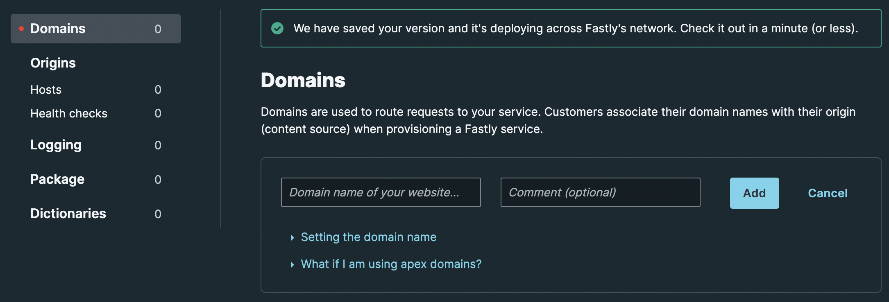

# Using Domains

Edge functions are accessed over HTTP so you need to add one or more domains to your Edge services to use it.

You can use a Fastly subdomain or bring your own domain. In either case, Compute@Edge requires TLS so you will need to have TLS enabled. All non-TLS URLs are redirect to TLS by Fastly.

For testing purposes, it may be useful to enable both.

## Using a Fastly Subdomain

A Fastly subdomain can be ideal for services with HTTP URLs that are not directly visible by users such as API services, media services, and others.

A Fastly subdomain looks like the following:

`your-subdomain.global.ssl.fastly.net`

Simply choose a subomdain using the format `<your_subdomain>.global.ssl.fastly.net` and add it to your Service configuration.

A Fastly subdomain comes with Fastly's Free TLS service which is documented in the [Setting up free TLS guide](https://docs.fastly.com/en/guides/setting-up-free-tls).

## Using Your Own Domain

You can also use your own domain as follows:

`www.your-domain.com`

Both Apex and non-Apex domains are supported. Due to the nuances of using Apex domains, you will have slightly less flexibility if you choose to use one.

With your own subdomain, you will need to do three things:

1. Decide on using a apex domain like `example.com` or subdomain like `www.example.com`.
1. Ensure you have a paid account
1. Add a certificate by using Fastly's integrations with Let's Encrypt and Globalsign or bringing your own

> Note: Since Compute@Edge requires TLS, you will not be able to use Let's Encrypt's manual certification provisioning process as the Let's Encrypt needs to access a file in the `.well-known` folder which won't be accessible.

## How to Add a Domain

In either case, start off by adding a domain to your service. You can do this using the Fastly Management Console or the API / SDKs.

=== "Console"
    In the [Fastly web management console](https://manage.fastly.com), nagivate to your Compute "Service configuration" page and then click on the "Domains" section to add a domain for your site.

    

=== "API & SDKs"
    Domains can be added via the ["Add a domain name to a service" API](https://developer.fastly.com/reference/api/services/domain/#create-domain).

    This API is located at:

    `POST https://api/service/{service_id}/version/{version_id}/domain`
