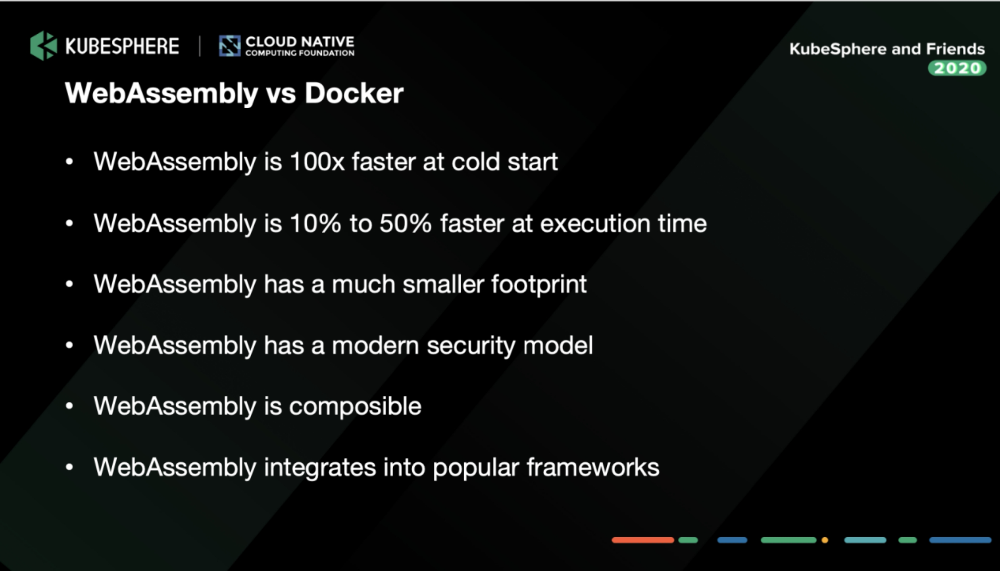

# Frequently Asked Questions

## Is Go Supported?

Go is not currently supported due to a lack of WebAssembly (WASI) support in the Go WASM implimentation as mentioned in the article [Evaluating new languages for Compute@Edge](https://www.fastly.com/blog/evaluating-new-languages-for-edge-compute). This is still the case as of May 2022.

>  Go WebAssembly does have good community documentation when targeting the web with Go WebAssembly, however stable support for compiling to the [WebAssembly System Interface (WASI)](https://wasi.dev/) is still an [open issue](https://github.com/golang/go/issues/31105) as of April, 2020.

## How does WebAssembly compare with Docker?

WebAssembly has some advantages over Docker including:

See more in this article by [Will Cloud-Native WebAssembly Replace Docker? by Michael Yuan and Yicen Xie](
https://kubesphere.io/blogs/will-cloud-native-webassembly-replace-docker_/)

Docker has some advantages over WebAssembly, including the ability to support more languages.