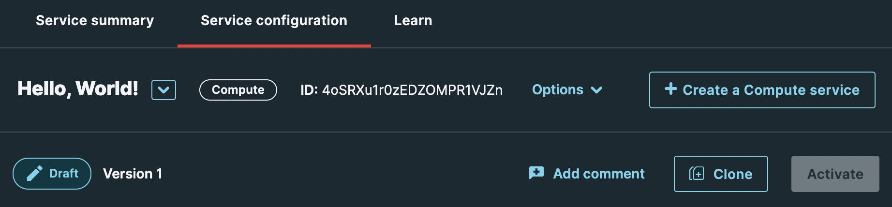

# Uploading and Activating a Edge Function Package

Deployment includes two steps, uploading the package and activating it.

These steps can be done via a variety of methods including the CLI, UI, API and API SDKs.

The core APIs used for all the approaches aside from the UI are to use the package upload API and the service activation API:

[**Upload a Compute@Edge package API**](https://developer.fastly.com/reference/api/services/package/#put-package)

`PUT /service/{service_id}/version/{version_id}/package`

[**Activate a service version API**](https://developer.fastly.com/reference/api/services/version/#activate-service-version)

`PUT /service/{service_id}/version/{version_id}/activate`

The following provides a short description of this for each.

=== "CLI"
    **Uploading and Activating the Package using the CLI**

    The [CLI is available from GitHub](https://github.com/fastly/cli). Using the Fastly CLI is described in detail in the [Learning Guide](https://developer.fastly.com/learning/compute/).

    From the project root, execute the following command. The command for building the package file, `fastly compute build`, should have created the file `pkg/my-package.tar.gz` in your project root.

    ``` bash
    % fastly compute deploy
    ```

=== "Console"
    **Uploading the Package with the Management Console**

    In the [Fastly web management console](https://manage.fastly.com), nagivate to your Compute "Service configuration" page and then use the drag-and-drop functionality to upload your Edge Code package.

    

    The in the upper right corner of the page, click the "Activate" button.

    

=== "cURL"

    **Uploading the Package with cURL**

    ``` bash
    % curl -D - -X PUT --location "https://api.fastly.com/service/SU1Z0isxPaozGVKXdv0eY/version/1/package" \
      -H "Accept: application/json" \
      -H "Fastly-Key: YOUR_FASTLY_TOKEN" \
      -H "expect: 100-continue" \
      -F "package=@/path/to/file"
    ```

    **Activating the Package with cURL**

    ``` bash
    % curl -D - -X PUT --location "https://api.fastly.com/service/SU1Z0isxPaozGVKXdv0eY/version/1/activate" \
      -H "Accept: application/json" \
      -H "Fastly-Key: YOUR_FASTLY_TOKEN"
    ```

=== "Go"
    [**Uploading the Package with Go ⇗**](https://pkg.go.dev/github.com/fastly/go-fastly/v6/fastly#Client.UpdatePackage)

    Call the `UpdatePackage` function on your `fastly.Client` instance, which has the following definition:

    ``` go
    func (c *Client) UpdatePackage(i *UpdatePackageInput) (*Package, error)
    ```

    Example function call:

    ``` go
    // fastlyClient is an instance of `fastly.Client`
    pkg, err := fastlyClient.UpdatePackage(
      &fastly.UpdatePackageInput{
        ServiceID: "YOUR_SERVICE_ID", // required
        ServiceVersion: 1, // required. Service version is an integer
        PackagePath: "/path/to/your-package.tar.gz",
      },
    )
    ```

    [**Activating the Package with Go ⇗**](https://pkg.go.dev/github.com/fastly/go-fastly/v6/fastly#Client.ActivateVersion)

    Call the `ActivateVersion` function on your `fastly.Client` instance, which has the following definition:

    ``` go
    func (c *Client) ActivateVersion(i *ActivateVersionInput) (*Version, error)
    ```

    Example function call:

    ``` go
    // fastlyClient is an instance of `fastly.Client`
    pkg, err := fastlyClient.ActivateVersion(
      &fastly.ActivateVersionInput{
        ServiceID: "YOUR_SERVICE_ID", // required
        ServiceVersion: 1, // required. Service version is an integer
      },
    )
    ```

=== "JavaScript"
    **Uploading the Package with JavaScript**

    Use the [JavaScript SDK's `putPackage` function](https://github.com/fastly/fastly-js/blob/main/docs/PackageApi.md#putPackage):

    ``` js
    const options = {
      service_id: "service_id_example", // required
      version_id: 56, // required
      expect: 100-continue,
      _package: "/path/to/file",
    };

    apiInstance.putPackage(options)
      .then((data) => {
        console.log(data, "API called successfully.");
      })
      .catch((error) => {
        console.error(error);
      });
    ```
    
    **Activating the Package with JavaScript**

    Use the [`activateServiceVersion` function](https://github.com/fastly/fastly-js/blob/main/docs/VersionApi.md#activateServiceVersion):

    ``` js
    const options = {
      service_id: "service_id_example", // required
      version_id: 56, // required
    };

    apiInstance.activateServiceVersion(options)
      .then((data) => {
        console.log(data, "API called successfully.");
      })
      .catch((error) => {
        console.error(error);
      });
    ```

=== "PHP"
    **Uploading the Package with PHP**

    Use the [PHP SDK's `putPackage` function](https://github.com/fastly/fastly-php/blob/main/docs/Api/PackageApi.md#putpackage):

    ``` php
    $options['service_id'] = 'service_id_example'; // string | Alphanumeric string identifying the service.
    $options['version_id'] = 56; // int | Integer identifying a service version.
    $options['expect'] = 100-continue; // string | We recommend using the Expect header because it may identify issues with the request based upon the headers alone instead of requiring you to wait until the entire binary package upload has completed.
    $options['package'] = "/path/to/file.txt"; // \SplFileObject | The content of the Wasm binary package.

    try {
        $result = $apiInstance->putPackage($options);
    } catch (Exception $e) {
        echo 'Exception when calling PackageApi->putPackage: ', $e->getMessage(), PHP_EOL;
    }
    ```

    **Activating the Package with PHP**

    Use the [PHP SDK's `activateserviceversion` function](https://github.com/fastly/fastly-php/blob/main/docs/Api/PackageApi.md#putpackage):
    
    ``` php
    $options['service_id'] = 'service_id_example'; // string | Alphanumeric string identifying the service.
    $options['version_id'] = 56; // int | Integer identifying a service version.

    try {
        $result = $apiInstance->activateServiceVersion($options);
    } catch (Exception $e) {
        echo 'Exception when calling VersionApi->activateServiceVersion: ', $e->getMessage(), PHP_EOL;
    }
    ```

=== "HTTP"
    **Uploading the Package HTTP info**

    ```
    PUT /service/SU1Z0isxPaozGVKXdv0eY/version/1/package HTTP/1.1
    Host: api.fastly.com
    Content-Type: multipart/form-data; boundary="boundary"
    Accept: application/json
    Fastly-Key: YOUR_FASTLY_TOKEN
    expect: 100-continue
    
    --boundary
    Content-Disposition: form-data; name="package"
    
    (binary data ...)
    ```

    **Activating the Package HTTP info**
    ```bash
    PUT /service/SU1Z0isxPaozGVKXdv0eY/version/1/activate HTTP/1.1
    Host: api.fastly.com
    Accept: application/json
    Fastly-Key: YOUR_FASTLY_TOKEN
    ```